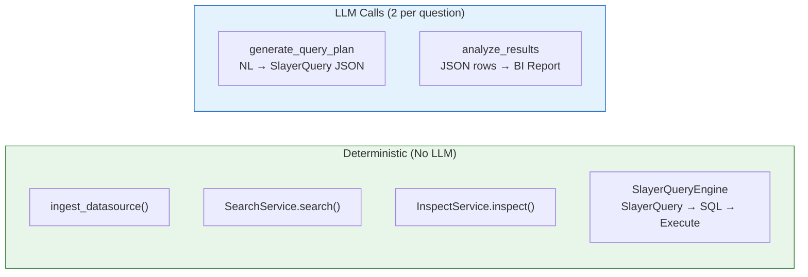
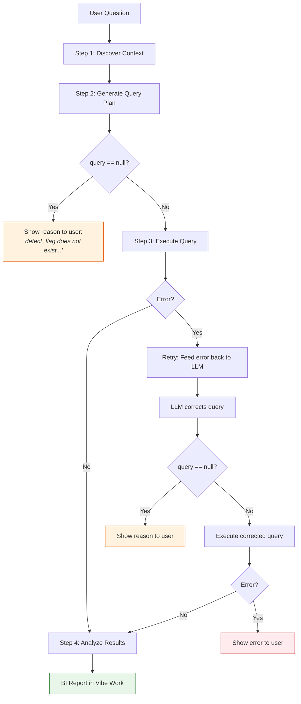

# Data Warehouse Query — Flow Diagram

## End-to-End Flow

Example question: **"Show revenue by region"**

```mermaid
flowchart TB
    subgraph VW["<b>VIBE WORK</b> (Cloud UI)"]
        U["User asks:<br/><i>'Show revenue by region'</i>"]
    end

    subgraph MO["<b>MISTRAL ORCHESTRATOR</b> (Cloud)"]
        T["Temporal Workflow Scheduler<br/>wf-scheduler.mistral.ai"]
    end

    subgraph LW["<b>LOCAL WORKER</b> (Your Machine)"]

        subgraph S1["<b>Step 1: discover_context</b><br/>SLayer — no LLM"]
            SEARCH["<b>SearchService.search()</b><br/>question='Show revenue by region'<br/>max_results=10"]
            HITS["Search Hits:<br/>fact_order.revenue (0.0164)<br/>dim_region.region_name (0.0161)<br/>fact_order (0.0159)<br/>dim_region (0.0156)"]
            MODELS["Unique models:<br/>[fact_order, dim_region]"]
            INSPECT["<b>InspectService.inspect()</b><br/>fact_order → 14 cols, 5 joins<br/>dim_region → 5 cols, 1 join"]
            CTX["Targeted Context<br/>~3K chars (not entire DB)"]

            SEARCH --> HITS --> MODELS --> INSPECT --> CTX
        end

        subgraph S2["<b>Step 2: generate_query_plan</b><br/>Mistral LLM — Call #1"]
            PROMPT["<b>System Prompt</b><br/>- Discovered schema context<br/>- SlayerQuery format spec<br/>- Business rules<br/>- 'Only use columns from schema'"]
            LLM1["<b>Mistral LLM</b><br/>Slot-filling: picks columns<br/>from discovered schema"]
            QUERY["SlayerQuery JSON:<br/>{<br/>  source_model: 'fact_order',<br/>  measures: ['sum(revenue)'],<br/>  dimensions: ['dim_region.region_name'],<br/>  filters: ['order_status = Completed']<br/>}"]

            PROMPT --> LLM1 --> QUERY
        end

        subgraph S3["<b>Step 3: execute_warehouse_query</b><br/>SLayer Engine — no LLM"]
            ENGINE["<b>SlayerQueryEngine</b><br/>Resolves joins from model graph<br/>Generates SQL dialect"]
            SQL["Generated SQL:<br/>SELECT dim_region.region_name,<br/>  SUM(fact_order.revenue)<br/>FROM fact_order<br/>LEFT JOIN dim_region<br/>  ON fact_order.region_id =<br/>  dim_region.region_id<br/>WHERE order_status = 'Completed'<br/>GROUP BY dim_region.region_name"]
            EXEC["Execute on SQLite"]
            ROWS["JSON Rows:<br/>[{region: Europe, rev: 322299},<br/> {region: Asia Pacific, rev: 299663},<br/> {region: Africa, rev: 287448},<br/> {region: Latin America, rev: 279950},<br/> {region: North America, rev: 232923}]"]

            ENGINE --> SQL --> EXEC --> ROWS
        end

        subgraph S4["<b>Step 4: analyze_results</b><br/>Mistral LLM — Call #2"]
            INPUT["<b>Input to LLM:</b><br/>- Question<br/>- SlayerQuery JSON<br/>- Result rows JSON"]
            LLM2["<b>Mistral LLM</b><br/>BI Analyst role"]
            REPORT["<b>BI Report:</b><br/>- Executive summary<br/>- Formatted data table<br/>- Unicode bar chart<br/>- Key insights & takeaways"]

            INPUT --> LLM2 --> REPORT
        end
    end

    subgraph OUT["<b>VIBE WORK</b> (Response)"]
        FINAL["<b>Revenue by Region</b><br/><br/>Europe █████████████████████ $322K<br/>Asia Pacific ████████████████ $299K<br/>Africa ███████████████ $287K<br/>Latin America ██████████████ $279K<br/>North America ████████████ $232K<br/><br/>Europe leads with 22.7% of total revenue"]
    end

    U --> T
    T --> S1
    CTX --> S2
    QUERY --> S3
    ROWS --> S4
    REPORT --> OUT

    style S1 fill:#e8f5e9,stroke:#2e7d32
    style S2 fill:#e3f2fd,stroke:#1565c0
    style S3 fill:#e8f5e9,stroke:#2e7d32
    style S4 fill:#e3f2fd,stroke:#1565c0
    style VW fill:#fff3e0,stroke:#e65100
    style OUT fill:#fff3e0,stroke:#e65100
    style MO fill:#f3e5f5,stroke:#6a1b9a
```

## What Uses LLM vs. What Doesn't

```mermaid
flowchart LR
    subgraph NO_LLM["Deterministic (No LLM)"]
        A["ingest_datasource()"]
        B["SearchService.search()"]
        C["InspectService.inspect()"]
        D["SlayerQueryEngine<br/>SlayerQuery → SQL → Execute"]
    end

    subgraph YES_LLM["LLM Calls (2 per question)"]
        E["generate_query_plan<br/>NL → SlayerQuery JSON"]
        F["analyze_results<br/>JSON rows → BI Report"]
    end

    style NO_LLM fill:#e8f5e9,stroke:#2e7d32
    style YES_LLM fill:#e3f2fd,stroke:#1565c0
```

## Error Handling Flow

```mermaid
flowchart TD
    Q["User Question"] --> DISC["Step 1: Discover Context"]
    DISC --> PLAN["Step 2: Generate Query Plan"]

    PLAN --> CHECK{"query == null?"}
    CHECK -->|Yes| REASON["Show reason to user:<br/><i>'defect_flag does not exist...'</i>"]
    CHECK -->|No| EXEC["Step 3: Execute Query"]

    EXEC --> ERR{"Error?"}
    ERR -->|No| ANALYZE["Step 4: Analyze Results"]
    ERR -->|Yes| RETRY["Retry: Feed error back to LLM"]

    RETRY --> PLAN2["LLM corrects query"]
    PLAN2 --> CHECK2{"query == null?"}
    CHECK2 -->|Yes| REASON2["Show reason to user"]
    CHECK2 -->|No| EXEC2["Execute corrected query"]

    EXEC2 --> ERR2{"Error?"}
    ERR2 -->|No| ANALYZE
    ERR2 -->|Yes| FAIL["Show error to user"]

    ANALYZE --> REPORT["BI Report in Vibe Work"]

    style REASON fill:#fff3e0,stroke:#e65100
    style REASON2 fill:#fff3e0,stroke:#e65100
    style FAIL fill:#ffebee,stroke:#c62828
    style REPORT fill:#e8f5e9,stroke:#2e7d32
```
